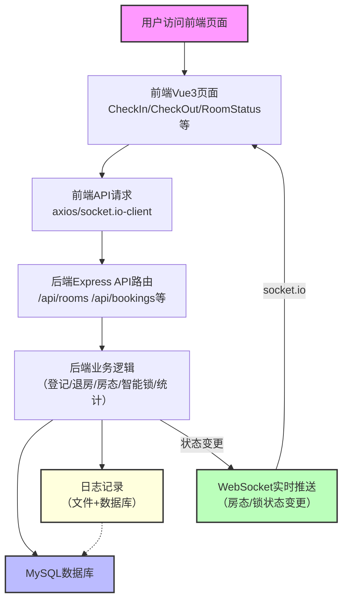

# 智能酒店管理系统-项目流程图

## 项目简介

本项目是一个基于前后端分离的智能酒店管理系统，支持客人自助登记、退房、智能锁管理、房间状态实时查询与推送。系统采用 Vue3 + Element Plus + TypeScript 构建前端，Node.js + Express + MySQL + Socket.io 构建后端，适用于中小型酒店的数字化、智能化升级。

---

> 本图展示了用户、前端、后端、数据库、WebSocket、日志等各环节的交互流程。 

cursor_project/
├── back_end/                 # 后端服务
│   ├── src/
│   │   ├── app.js           # 主应用入口，注册所有路由和Socket.io
│   │   ├── config/
│   │   │   └── database.js  # 数据库连接池配置
│   │   ├── routes/          # 路由文件
│   │   │   ├── auth.js      # 系统状态与认证
│   │   │   ├── rooms.js     # 房间管理
│   │   │   ├── guests.js    # 客人管理
│   │   │   ├── bookings.js  # 预订与入住/退房
│   │   │   ├── smartLock.js # 智能锁管理
│   │   │   └── statistics.js# 统计分析
│   │   └── utils/
│   │       └── logger.js    # 日志工具，支持写入数据库和文件
│   ├── package.json         # 后端依赖
│   ├── env.example          # 环境变量示例
│   ├── start.js             # 启动脚本
│   ├── setup_database.sh    # 一键初始化数据库脚本
│   └── test_db.js           # 数据库连接测试
├── front_end/                # 前端应用
│   ├── src/
│   │   ├── views/           # 页面组件
│   │   │   ├── CheckIn.vue      # 自助登记
│   │   │   ├── CheckOut.vue     # 自助退房
│   │   │   ├── RoomStatus.vue   # 房间状态
│   │   │   ├── BookingQuery.vue # 预订查询
│   │   │   ├── SmartLock.vue    # 智能锁管理
│   │   │   ├── BookingManagement.vue # 预订管理
│   │   │   └── Statistics.vue   # 数据统计
│   │   ├── layout/          # 公共布局
│   │   ├── router/          # 路由配置
│   │   │   └── index.ts     # 路由定义
│   │   ├── App.vue          # 主应用
│   │   └── main.ts          # 入口文件
│   ├── package.json         # 前端依赖
│   ├── vite.config.ts       # Vite配置
│   └── index.html           # HTML模板
├── init_database.sql        # 数据库初始化SQL
├── start_linux.sh           # Linux一键启动脚本
├── start.bat                # Windows一键启动脚本
├── README.md                # 项目说明
└── QUICK_START.md           # 快速上手指南

---

## 各部分用到的技术与使用方式

### 1. 前端（front_end/）
- **Vue 3 + TypeScript**：
  - 采用 Composition API，所有页面组件（如 CheckIn.vue、CheckOut.vue 等）均为单文件组件，类型安全、响应式强。
- **Element Plus**：
  - 用于 UI 组件（表单、弹窗、表格、Tabs、消息提示等），提升开发效率和界面美观。
- **Pinia**：
  - 状态管理库，管理全局状态（如用户信息、房间列表等）。
- **Vue Router**：
  - 单页应用路由，所有页面均有独立路由，见 src/router/index.ts。
- **Axios**：
  - 用于与后端 RESTful API 通信，所有数据交互均通过 axios 发起 HTTP 请求。
- **socket.io-client**：
  - 实现前端与后端的 WebSocket 实时通信，自动监听房间状态、智能锁等变更。
- **ECharts**：
  - 用于数据统计页面的图表展示（如入住率、营收、房型分布等）。
- **Vite**：
  - 前端开发与构建工具，支持热更新和高效打包。
- **Sass/CSS**：
  - 页面样式，支持响应式设计。

#### 使用方式：
- 通过 `npm run dev` 启动开发服务器，访问 http://localhost:3000。
- 组件间通过 props/emit、Pinia 状态、路由参数等通信。
- 所有 API 地址统一以 `/api/` 开头，自动代理到后端。
- WebSocket 连接在页面挂载时建立，断开时自动关闭。

### 2. 后端（back_end/）
- **Node.js + Express**：
  - 提供 RESTful API 服务，所有业务逻辑均为中间件和路由处理。
- **MySQL2**：
  - 连接 MySQL 数据库，支持连接池，所有数据操作均为异步。
- **Socket.io**：
  - 实现 WebSocket 服务，支持房间状态、智能锁等实时推送。
- **Winston**：
  - 日志库，支持写入文件和数据库，便于审计和排查。
- **dotenv**：
  - 加载 .env 环境变量，便于配置数据库、端口、前端地址等。
- **helmet**：
  - 增强 HTTP 头安全，防止常见攻击。
- **express-rate-limit**：
  - 限流，防止接口被刷。
- **CORS**：
  - 跨域资源共享，允许前端安全访问后端。
- **bcryptjs/jsonwebtoken**：
  - 可用于用户认证、加密（如有后台管理需求）。

#### 使用方式：
- 通过 `npm run dev` 启动开发服务器，监听 5000 端口。
- 路由分模块管理，所有 API 统一以 `/api/` 开头。
- 业务逻辑与数据库操作分离，便于维护和扩展。
- WebSocket 通过 io.emit 广播状态变更，前端自动接收。
- 日志自动写入 logs/ 目录和 system_logs 表。

### 3. 数据库（MySQL）
- **表结构**：见 `init_database.sql`，包括 rooms、guests、bookings、check_ins、system_logs、lock_operations。
- **外键约束**：所有业务表均有外键，保证数据一致性。
- **索引优化**：常用字段均有索引，提升查询效率。
- **初始化**：
  - 通过 `mysql -u root -p < init_database.sql` 一键初始化。
  - 或运行 `setup_database.sh` 脚本自动建库建表。

### 4. 通信与实时推送
- **RESTful API**：
  - 前端通过 axios 调用后端 API，完成登记、退房、查询等操作。
- **WebSocket（socket.io）**：
  - 后端在房间状态、智能锁等变更时，自动 io.emit 广播。
  - 前端 socket.io-client 监听事件，自动刷新页面数据。
  - 典型场景：退房后房态自动刷新，无需手动刷新页面。

### 5. 日志与安全
- **Winston 日志**：
  - 所有操作、异常均写入 logs/combined.log、logs/error.log 和数据库 system_logs 表。
- **helmet + rate-limit**：
  - 防止 XSS、CSRF、暴力破解等常见攻击。
- **CORS**：
  - 只允许指定前端地址访问后端。
- **表单校验**：
  - 前端所有表单均有严格校验，防止无效/恶意数据。

---

## 项目使用流程

1. **客人自助登记**
   - 访问"自助登记"页面，选择空闲房间、填写个人信息、设置智能锁密码。
   - 前端通过 API 提交登记信息，后端校验并写入数据库，分配房间并生成入住记录。
   - 登记成功后，前端弹窗显示房号和智能锁密码。
   - 房间状态自动变为"已入住"，并通过 WebSocket 实时推送给所有前端页面。

2. **客人自助退房**
   - 访问"自助退房"页面，输入房号和智能锁密码。
   - 后端校验信息，更新预订和入住记录状态，房间状态变为"空闲"，智能锁密码自动重置。
   - 退房成功后，前端弹窗提示，房间状态实时推送到所有页面。

3. **房间状态与查询**
   - "房间状态"页面实时展示所有房间的状态，支持按房号搜索和状态筛选。
   - 所有房态变更均通过 WebSocket 实时同步，无需手动刷新。

4. **智能锁管理**
   - 管理员或客人可在"智能锁管理"页面设置/重置锁密码，所有操作均有日志记录。

5. **数据统计与日志**
   - "数据统计"页面展示入住率、营收、房型分布、客源地等多维度数据。
   - 所有操作和异常均自动记录到日志文件和数据库，便于审计和追踪。

---

如需进一步了解每一部分的代码实现和技术细节，请查阅对应目录下的源码和注释。

---

# 智能酒店管理系统说明文档

## 开发环境
- 操作系统：Linux（推荐 Ubuntu 20.04 及以上）
- 前端开发工具：VSCode、WebStorm、Vue3/TypeScript
- 后端开发工具：Vim、VSCode、WebStorm、 Node.js
- 数据库：MySQL 8.0+
- 命令行工具：bash、npm、mysql-client

## 主要开发工具
- 前端：Vue3 + Element Plus + TypeScript + Vite
- 后端：Node.js + Express + Socket.io + MySQL2 + Winston
- 数据库管理：MySQL
- 文本编辑器：vim（后端 C 语言部分）、VSCode（全栈推荐）

## 需求分析
- 信息查找功能：支持按房号、客人姓名、身份证号等多条件查找房间和入住信息。
- 统计功能：支持统计入住率、营收、房型分布、客源地等多维度数据。
- 排序功能：支持按房价、入住时间、房间号等多种方式排序房间或预订信息。
- 登记功能：支持客人自助登记入住，填写个人信息、选择房型、设置智能锁密码。
- 结账功能：支持客人自助退房，验证房号和智能锁密码，自动结算并释放房间。

## 设计思路
- 数据结构设计：前端采用响应式数据结构（Vue3 Composition API），后端采用关系型数据库（MySQL）存储所有业务数据。C 语言版本采用动态链表存储房间和入住信息，便于频繁增删改查，节省内存空间。
- 存储方式：主要数据存储在 MySQL 数据库，保证数据一致性和高效查询。C 语言实现中，采用文件存储（occupied_rooms.dat、checkedout_rooms.dat）与数据库存储结合，便于数据持久化和后续查找。
- 前后端分离架构：前端通过 RESTful API 与后端通信，所有业务操作均由后端统一处理。WebSocket 实现房间状态、智能锁等实时推送，提升用户体验。
- 安全与日志：后端集成 helmet、rate-limit、CORS 等安全中间件，防止常见攻击。所有操作和异常均自动记录到日志文件和数据库，便于审计和追踪。

## 功能实现
1. 信息查找功能
   - 前端页面支持多条件搜索，后端 API 支持模糊查询和多字段筛选。
   - C 语言实现中，主函数传递链表头节点，遍历链表查找匹配项，打印结果或提示无数据。
2. 统计功能
   - 前端"数据统计"页面展示入住率、营收、房型分布、客源地等。
   - 后端统计路由（/api/statistics）聚合数据，前端通过 ECharts 图表展示。
   - C 语言实现中，遍历链表统计符合条件的数据，打印统计结果。
3. 排序功能
   - 前端支持表格排序（如房价、入住时间等）。
   - C 语言实现中，定义中间结构体，采用冒泡排序法交换内容，打印排序结果。
4. 登记功能
   - 前端"自助登记"页面，客人选择房型、填写信息、设置智能锁密码。
   - 后端校验数据，写入数据库，分配房间并生成入住记录。
   - C 语言实现中，询问登记人数和房型，打印空置房间，填写信息后登记成功。
5. 结账功能
   - 前端"自助退房"页面，客人输入房号和智能锁密码，确认退房。
   - 后端校验信息，更新预订和入住记录状态，房间状态变为"空闲"，智能锁密码自动重置。
   - C 语言实现中，房客报房号，前台查询信息，确认无误后修改退房状态，系统自动删除退房信息。

## 项目使用流程
- 客人自助登记
  - 访问"自助登记"页面，选择空闲房间、填写个人信息、设置智能锁密码。
  - 前端通过 API 提交登记信息，后端校验并写入数据库，分配房间并生成入住记录。
  - 登记成功后，前端弹窗显示房号和智能锁密码，房间状态自动变为"已入住"，并通过 WebSocket 实时推送给所有前端页面。
- 客人自助退房
  - 访问"自助退房"页面，输入房号和智能锁密码。
  - 后端校验信息，更新预订和入住记录状态，房间状态变为"空闲"，智能锁密码自动重置。
  - 退房成功后，前端弹窗提示，房间状态实时推送到所有页面。
- 房间状态与查询
  - "房间状态"页面实时展示所有房间的状态，支持按房号搜索和状态筛选。
  - 所有房态变更均通过 WebSocket 实时同步，无需手动刷新。
- 智能锁管理
  - 管理员或客人可在"智能锁管理"页面设置/重置锁密码，所有操作均有日志记录。
- 数据统计与日志
  - "数据统计"页面展示入住率、营收、房型分布、客源地等多维度数据。
  - 所有操作和异常均自动记录到日志文件和数据库，便于审计和追踪。

## 总结
本系统已实现酒店前台管理的主要功能，支持自助登记、退房、信息查找、统计、排序等。采用前后端分离架构，支持 Web 端和 C 语言终端两种实现方式，数据统一存储于 MySQL，支持文件与数据库双重持久化。
系统具备良好的可扩展性和安全性，适合中小型酒店数字化升级。未来可进一步优化用户体验、增加人脸/指纹/瞳孔等生物识别、完善权限管理等功能，实现更高效、更智能的酒店管理。

 